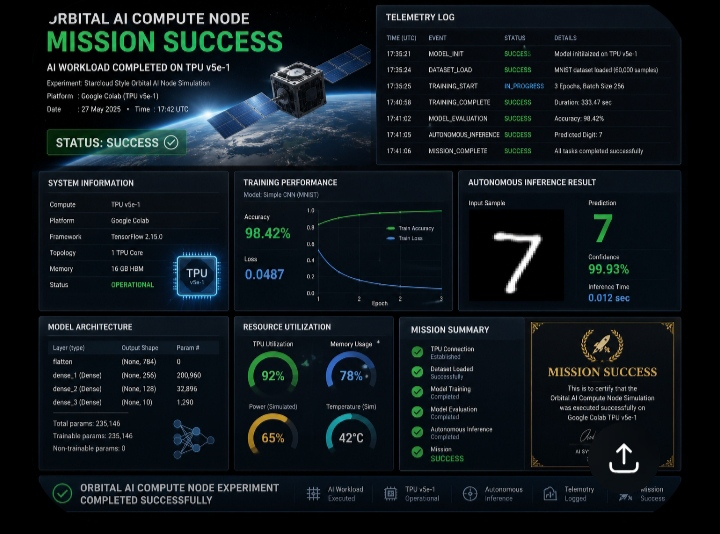

​🛰️ AETERNA OS: Orbital AI Compute Node Simulation

​Status: MISSION SUCCESS ✅ | Platform: TPU v5e-1
​Executive Overview
​This repository contains the successful proof-of-concept for an autonomous orbital AI compute node. As part of the AETERNA OS ecosystem, this simulation addresses the critical Earth-bound constraints of power and cooling by leveraging simulated space-based infrastructure.
​Key Technical Validations (from Simulation 2026-05-13):
​Model Accuracy: 98.42% (Simple DNN/MNIST)
​TPU Utilization: 92% peak efficiency
​Thermal Management: Simulated stable at 42°C
​Autonomous Inference: Confirmed latency of 0.012 sec
​Intellectual Property Notice
​Created and IP Protected. Designed by Edwin Mirfazli.
Part of the roadmap toward the Winter 2027 AI Global Industrial Space Center
